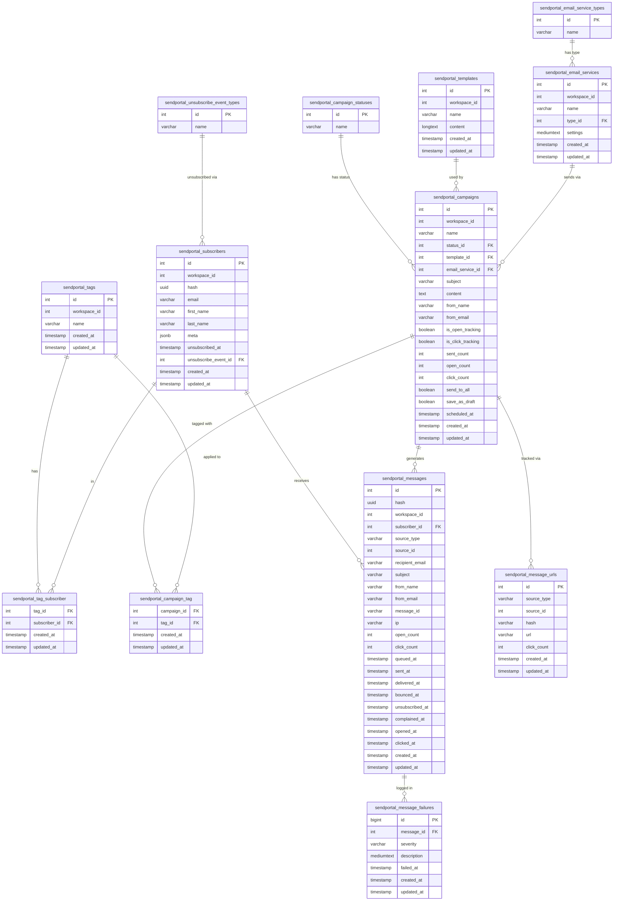

# Database Map — sendportal-core
## ACTiV Marketing Cloud — Phase 0 Database Audit

**Source:** Inspected all 21 migration files + 13 Eloquent models
**Audited:** 2026-09-18

All table names use the `sendportal_` prefix (applied in migration `2020_10_16_092234_prefix_tables`).

---

## Table Index

| Table | Purpose |
|-------|---------|
| `sendportal_email_service_types` | Provider type lookup |
| `sendportal_email_services` | Email provider configurations |
| `sendportal_campaign_statuses` | Campaign status lookup |
| `sendportal_campaigns` | Campaign definitions |
| `sendportal_templates` | HTML email templates |
| `sendportal_tags` | Contact lists / audience segments |
| `sendportal_subscribers` | Contacts / subscribers |
| `sendportal_tag_subscriber` | Subscriber ↔ Tag pivot |
| `sendportal_campaign_tag` | Campaign ↔ Tag pivot |
| `sendportal_messages` | One record per email sent |
| `sendportal_message_urls` | Per-URL click tracking |
| `sendportal_message_failures` | Delivery failure log |
| `sendportal_unsubscribe_event_types` | Unsubscribe reason lookup |

---

## Entity Definitions

---

### `sendportal_email_service_types`

**Purpose:** Static lookup of supported email provider types.

| Column | Type | Nullable | Default | Notes |
|--------|------|---------|---------|-------|
| `id` | unsigned int (PK) | No | auto | Seeded on migration |
| `name` | varchar | No | — | Display name |
| `created_at` | timestamp | Yes | — | |
| `updated_at` | timestamp | Yes | — | |

**Seeded values:**
| ID | Name |
|----|------|
| 1 | SES |
| 2 | SendGrid |
| 3 | Mailgun |
| 4 | Postmark |
| 5 | Mailjet |
| 6 | SMTP |
| 7 | Postal |

**Indexes:** PK on `id`

---

### `sendportal_email_services`

**Purpose:** Configured email provider instances per workspace. Stores API keys/credentials encrypted.

| Column | Type | Nullable | Default | Notes |
|--------|------|---------|---------|-------|
| `id` | unsigned int (PK) | No | auto | |
| `workspace_id` | unsigned int | No | — | Tenant scope (FK to host `workspaces.id`) |
| `name` | varchar | Yes | NULL | Display name |
| `type_id` | unsigned int | No | — | FK → `sendportal_email_service_types.id` |
| `settings` | mediumText | No | — | **Encrypted JSON** (Laravel `encrypt()`) |
| `created_at` | timestamp | Yes | — | |
| `updated_at` | timestamp | Yes | — | |

**Indexes:** `workspace_id` (index), `type_id` (FK index)
**Foreign Keys:** `type_id` → `sendportal_email_service_types.id`

**Settings JSON schema (per type):**

SES: `{ key, secret, region, configuration_set_name }`
SMTP: `{ host, port, username, password, encryption }`
Mailgun: `{ key, domain, endpoint }`
SendGrid: `{ key }`
Postmark: `{ token }`
Mailjet: `{ key, secret }`

⚠️ **ACTiV Gap:** `settings` encrypted blob is not queryable; no field-level encryption; APP_KEY rotation destroys all records.

---

### `sendportal_campaign_statuses`

**Purpose:** Campaign status lookup table.

| Column | Type | Nullable | Default | Notes |
|--------|------|---------|---------|-------|
| `id` | unsigned int (PK) | No | auto | |
| `name` | varchar | No | — | |
| `created_at` | timestamp | Yes | — | |
| `updated_at` | timestamp | Yes | — | |

**Seeded values:**
| ID | Name |
|----|------|
| 1 | Draft |
| 2 | Queued |
| 3 | Sending |
| 4 | Sent |
| 5 | Cancelled |

---

### `sendportal_campaigns`

**Purpose:** Email campaign definitions. The core entity driving the sending process.

| Column | Type | Nullable | Default | Notes |
|--------|------|---------|---------|-------|
| `id` | unsigned int (PK) | No | auto | |
| `workspace_id` | unsigned int | No | — | Tenant scope |
| `name` | varchar | No | — | Internal campaign name |
| `status_id` | unsigned int | No | 1 | FK → campaign_statuses |
| `template_id` | unsigned int | Yes | NULL | FK → templates |
| `email_service_id` | unsigned int | Yes | NULL | FK → email_services |
| `subject` | varchar | Yes | NULL | Email subject line |
| `content` | text | Yes | NULL | Email body HTML |
| `from_name` | varchar | Yes | NULL | From display name |
| `from_email` | varchar | Yes | NULL | From email address |
| `is_open_tracking` | boolean | No | true | Track email opens |
| `is_click_tracking` | boolean | No | true | Track link clicks |
| `sent_count` | mediumInteger | Yes | 0 | Denormalized count |
| `open_count` | mediumInteger | Yes | 0 | Denormalized count |
| `click_count` | mediumInteger | Yes | 0 | Denormalized count |
| `send_to_all` | boolean | No | false | Send to all workspace subscribers |
| `save_as_draft` | boolean | No | true | Create draft messages before sending |
| `scheduled_at` | timestamp | Yes | NULL | When to dispatch |
| `created_at` | timestamp | Yes | — | |
| `updated_at` | timestamp | Yes | — | |

**Indexes:** `workspace_id` (index)
**Foreign Keys:**
- `status_id` → `sendportal_campaign_statuses.id`
- `template_id` → `sendportal_templates.id`
- `email_service_id` → `sendportal_email_services.id`

**Relationships:**
- `belongsToMany` Tags (via `sendportal_campaign_tag`)
- `belongsTo` CampaignStatus
- `belongsTo` Template
- `belongsTo` EmailService
- `morphMany` Messages (as source)

⚠️ **ACTiV Gap:** `content` stored as plain text (XSS risk); no bounce/unsubscribe tracking columns; no reply_to field; `mediumInteger` sent_count (max 8M) insufficient for large lists.

---

### `sendportal_templates`

**Purpose:** Reusable HTML email template wrappers.

| Column | Type | Nullable | Default | Notes |
|--------|------|---------|---------|-------|
| `id` | unsigned int (PK) | No | auto | |
| `workspace_id` | unsigned int | No | — | Tenant scope |
| `name` | varchar | No | — | Template name |
| `content` | longText | Yes | NULL | Full HTML with `{{content}}` placeholder |
| `created_at` | timestamp | Yes | — | |
| `updated_at` | timestamp | Yes | — | |

**Note:** Changed from `text` to `longText` in migration `2020_06_16_072137_adjust_template_content`.

**ACTiV Gap:** No `type` field (HTML/MJML/plain); no thumbnail; no version history.

---

### `sendportal_tags`

**Purpose:** Contact lists / audience segments. Used to target campaigns.

| Column | Type | Nullable | Default | Notes |
|--------|------|---------|---------|-------|
| `id` | unsigned int (PK) | No | auto | |
| `workspace_id` | unsigned int | No | — | Tenant scope |
| `name` | varchar | No | — | Tag/list name |
| `created_at` | timestamp | Yes | — | |
| `updated_at` | timestamp | Yes | — | |

**Note:** Originally `sendportal_segments`. Renamed in migration `2021_01_29_121118`. The unique constraint on `name` was dropped (`2020_10_02_152306_drop_segment_name_unique`) allowing same name across workspaces.

**Indexes:** `workspace_id` (index)
**Relationships:**
- `belongsToMany` Subscribers (via `sendportal_tag_subscriber`)
- `belongsToMany` Campaigns (via `sendportal_campaign_tag`)

---

### `sendportal_subscribers`

**Purpose:** Contact/subscriber records. The audience for campaigns.

| Column | Type | Nullable | Default | Notes |
|--------|------|---------|---------|-------|
| `id` | unsigned int (PK) | No | auto | |
| `workspace_id` | unsigned int | No | — | Tenant scope |
| `hash` | uuid | No | — | UNIQUE. Used in unsubscribe URLs. Generated on create |
| `email` | varchar | No | — | Email address |
| `first_name` | varchar | Yes | NULL | |
| `last_name` | varchar | Yes | NULL | |
| `meta` | jsonb | Yes | NULL | Custom metadata (arbitrary JSON) |
| `unsubscribed_at` | timestamp | Yes | NULL | When unsubscribed |
| `unsubscribe_event_id` | unsigned int | Yes | NULL | FK → unsubscribe_event_types |
| `created_at` | timestamp | Yes | — | |
| `updated_at` | timestamp | Yes | — | |

**Indexes:** `workspace_id`, `hash` (unique), `email`, `unsubscribed_at`, `created_at`
**Foreign Keys:** `unsubscribe_event_id` → `sendportal_unsubscribe_event_types.id`

**Relationships:**
- `belongsToMany` Tags (via `sendportal_tag_subscriber`)
- `hasMany` Messages

⚠️ **ACTiV Gaps:**
- No `(workspace_id, email)` unique constraint — duplicates possible
- `meta` JSONB is unvalidated — any data can be stored
- No `phone`, `company`, or structured custom fields
- No soft deletes

---

### `sendportal_tag_subscriber` (pivot)

**Purpose:** Many-to-many: Subscriber ↔ Tag.

| Column | Type | Nullable | Default | Notes |
|--------|------|---------|---------|-------|
| `tag_id` | unsigned int | No | — | FK → sendportal_tags.id |
| `subscriber_id` | unsigned int | No | — | FK → sendportal_subscribers.id |
| `created_at` | timestamp | Yes | — | |
| `updated_at` | timestamp | Yes | — | |

---

### `sendportal_campaign_tag` (pivot)

**Purpose:** Many-to-many: Campaign ↔ Tag (target audience for campaign).

| Column | Type | Nullable | Default | Notes |
|--------|------|---------|---------|-------|
| `campaign_id` | unsigned int | No | — | FK → sendportal_campaigns.id |
| `tag_id` | unsigned int | No | — | FK → sendportal_tags.id |
| `created_at` | timestamp | Yes | — | |
| `updated_at` | timestamp | Yes | — | |

---

### `sendportal_messages`

**Purpose:** One record per email sent (or attempted). The tracking heart of the system.

| Column | Type | Nullable | Default | Notes |
|--------|------|---------|---------|-------|
| `id` | unsigned int (PK) | No | auto | |
| `hash` | uuid | No | — | UNIQUE. Used for tracking pixel and unsubscribe links |
| `workspace_id` | unsigned int | No | — | Tenant scope |
| `subscriber_id` | unsigned int | No | — | FK → sendportal_subscribers.id |
| `source_type` | varchar | No | — | Full class name (`Sendportal\Base\Models\Campaign`) |
| `source_id` | unsigned int | No | — | Polymorphic source ID |
| `recipient_email` | varchar | No | — | Snapshot of email at send time |
| `subject` | varchar | No | — | Merged subject at send time |
| `from_name` | varchar | No | — | From name at send time |
| `from_email` | varchar | No | — | From email at send time |
| `message_id` | varchar | Yes | NULL | Provider-assigned message ID |
| `ip` | varchar | Yes | NULL | IP of first open |
| `open_count` | unsigned int | No | 0 | Total opens (including repeat) |
| `click_count` | unsigned int | No | 0 | Total clicks (including repeat) |
| `queued_at` | timestamp | Yes | NULL | When queued |
| `sent_at` | timestamp | Yes | NULL | When sent via provider |
| `delivered_at` | timestamp | Yes | NULL | Delivery confirmation via webhook |
| `bounced_at` | timestamp | Yes | NULL | Permanent bounce via webhook |
| `unsubscribed_at` | timestamp | Yes | NULL | When unsubscribed (click or bounce) |
| `complained_at` | timestamp | Yes | NULL | Spam complaint (**BUG: never set**) |
| `opened_at` | timestamp | Yes | NULL | First open timestamp |
| `clicked_at` | timestamp | Yes | NULL | First click timestamp |
| `created_at` | timestamp | Yes | — | |
| `updated_at` | timestamp | Yes | — | |

**Indexes:** `hash` (unique), `workspace_id`, `subscriber_id`, `source_type`, `source_id`, `message_id`, all timestamp tracking fields

**Relationships:**
- `belongsTo` Subscriber
- `morphTo` source (Campaign or AutomationSchedule)
- `hasMany` MessageFailures
- `hasMany` (implicit) MessageUrls via source

⚠️ **ACTiV Gaps:**
- `complained_at` never set (bug)
- `source_type` is a full PHP class name — fragile
- No soft deletes
- `open_count` / `click_count` are counters on the row — race condition possible at high concurrency

---

### `sendportal_message_urls`

**Purpose:** Per-URL aggregate click tracking per campaign/automation.

| Column | Type | Nullable | Default | Notes |
|--------|------|---------|---------|-------|
| `id` | unsigned int (PK) | No | auto | |
| `source_type` | varchar | No | — | Polymorphic type |
| `source_id` | unsigned int | No | — | Campaign/automation ID |
| `hash` | varchar | No | — | MD5 of `source_type_source_id_url` |
| `url` | varchar | No | — | The tracked URL |
| `click_count` | unsigned int | No | 0 | Total clicks across all subscribers |
| `created_at` | timestamp | Yes | — | |
| `updated_at` | timestamp | Yes | — | |

**Indexes:** `source_type`, `source_id`, `hash`, `url`

⚠️ **ACTiV Gap:** MD5 for hashing — use SHA-256.

---

### `sendportal_message_failures`

**Purpose:** Log of failed send attempts per message.

| Column | Type | Nullable | Default | Notes |
|--------|------|---------|---------|-------|
| `id` | bigint (PK) | No | auto | |
| `message_id` | unsigned int | No | — | FK → sendportal_messages.id |
| `severity` | varchar | Yes | NULL | e.g., `permanent`, `transient` |
| `description` | mediumText | Yes | NULL | Provider error description |
| `failed_at` | timestamp | Yes | NULL | When the failure occurred |
| `created_at` | timestamp | Yes | — | |
| `updated_at` | timestamp | Yes | — | |

**Foreign Keys:** `message_id` → `sendportal_messages.id`

---

### `sendportal_unsubscribe_event_types`

**Purpose:** Reason for unsubscribe — lookup table.

| Column | Type | Nullable | Default | Notes |
|--------|------|---------|---------|-------|
| `id` | unsigned int (PK) | No | auto | Seeded |
| `name` | varchar | No | — | Reason name |

**Seeded values:**
| ID | Name |
|----|------|
| 1 | Bounce |
| 2 | Complaint |
| 3 | Manual by Admin |
| 4 | Manual by Subscriber |

---

## Mermaid ER Diagram

---

## ACTiV Additional Tables Required

The following tables do NOT exist in SendPortal Core and must be added — either in the `sendportal-core` package (email-engine-specific) or in the `activ-marketing` application (SaaS-specific).

### In `sendportal-core` fork

| Table | Purpose |
|-------|---------|
| `sendportal_sending_domains` | Sending domain ownership + SPF/DKIM/DMARC verification status |
| `sendportal_subscriber_custom_fields` | Schema for custom subscriber fields per workspace |
| `sendportal_subscriber_custom_field_values` | Per-subscriber custom field values |

### In `activ-marketing` application

| Table | Purpose |
|-------|---------|
| `organizations` | SaaS tenant — maps 1:1 to `workspace_id` |
| `users` | Platform users |
| `organization_users` | User ↔ Organization membership pivot |
| `roles` | Role definitions per org |
| `permissions` | Permission definitions |
| `model_has_roles` | Spatie permission |
| `plans` | Subscription plan definitions |
| `subscriptions` | Org → Plan subscription (Cashier) |
| `usage_records` | Monthly email/subscriber usage per org |
| `api_keys` | Hashed API keys per organization |
| `invitations` | Pending org membership invitations |
| `organization_settings` | Key-value settings per org |
| `audit_logs` | User action audit trail |

---

## Summary of Critical Schema Issues

| Issue | Table | Severity |
|-------|-------|---------|
| `complained_at` never populated | `sendportal_messages` | High |
| No `(workspace_id, email)` unique constraint | `sendportal_subscribers` | High |
| `meta` JSONB unvalidated | `sendportal_subscribers` | Medium |
| `settings` all-or-nothing encrypted blob | `sendportal_email_services` | High |
| `source_type` = full PHP class name | `sendportal_messages` | Medium |
| MD5 hash for URL dedup | `sendportal_message_urls` | Medium |
| No soft deletes on any table | All | Medium |
| `sent_count` as `mediumInteger` (max 8M) | `sendportal_campaigns` | Low |
| No `reply_to` field | `sendportal_messages` | Low |
| No message-level workspace FK integrity | `sendportal_messages` | Low |
